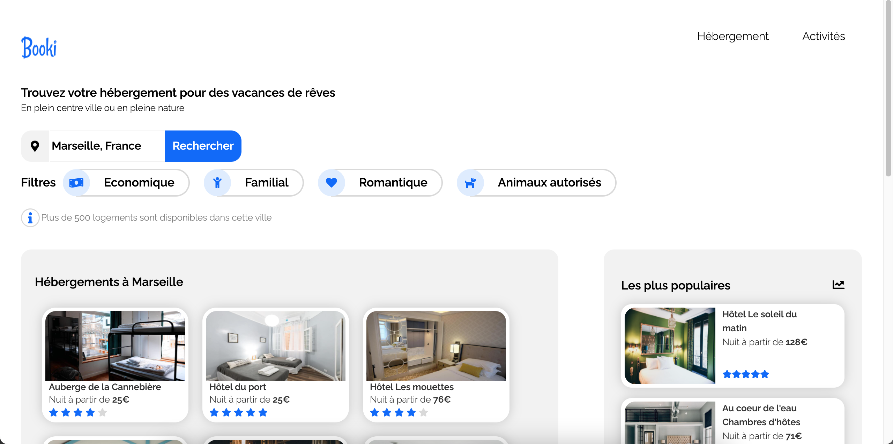

# Booki Project

## Introduction

Il s'agit de mon premier projet en HTML5 et CSS3.

L'objectif de ce projet est d'utiliser une maquette qui est imposée par l'UX designer pour l'integrer à notre site. 
Pour cela, il faut dans un premier temps analyser la maquette pour la découper et ainsi determiner les les différentes sections HTML.

