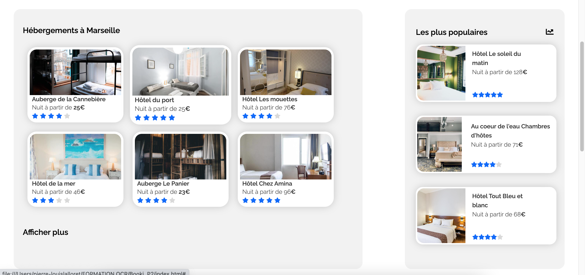
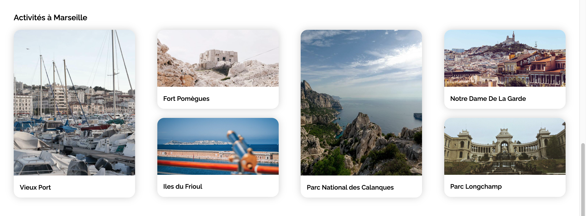
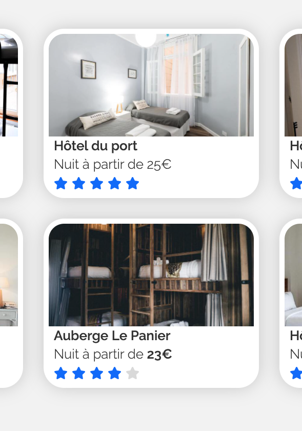
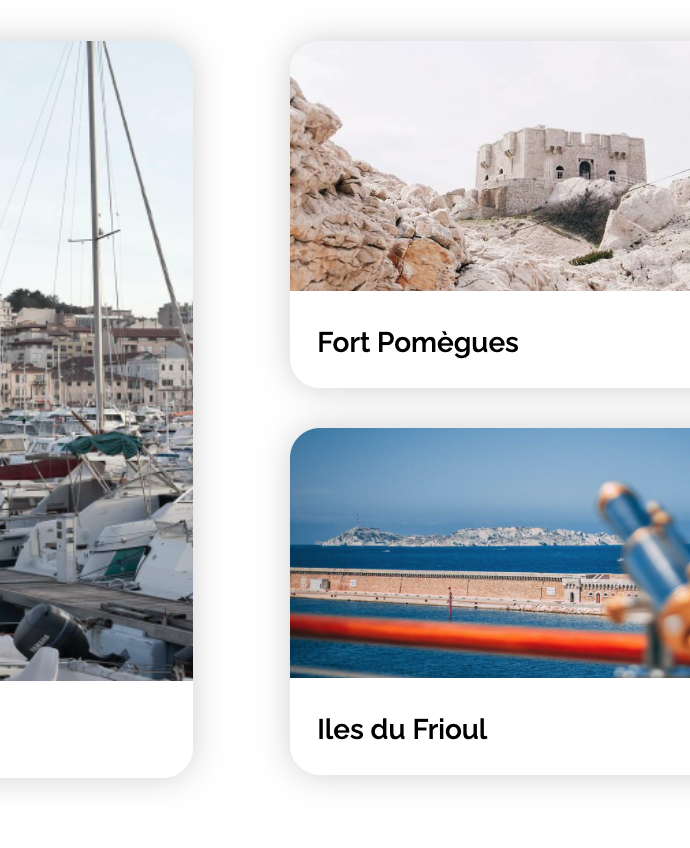

# Booki Project

## Présentation

Il s'agit de mon premier projet en HTML5 et CSS3.

L'objectif de ce projet est d'utiliser une maquette qui est imposée par l'UX designer de l'entreprise pour l'intégrer à notre site. Pour cela avant de coder il ne faut réaliser une maquette afon ded eterminer la structure a la fois globale de la page et celui de chaque élément.
Il nous est aussi demandé de faire le responsive de la page à savoir l'adpater pour les écrans de petites tailles (mobile).

## Détails du projet
### Maquette

Analyser la maquette pour la découper et ainsi determiner les les différentes sections HTML. Il est important d'utiliser des balises sémantique afin d'optimiser à la fois la structure mais aussi la vitesse de la page.

Une fois le découpage efféctué, il convient de commencer à coder en commençant par le haeder et de descendre au fur et à mesure sur la page.
### Sections

La page web se compose principalement de deux grandes sections:

-> Les hébérgements & les plus populaires (regroupés dans la même div).
-> Les activités

Chaque section fonctionne de manière autonome et leurs tailles sont gerées en % afin de faciliter le coder et d'automatiser la disposition des elements sur l'écran.

 

### Code & Algo

Sans grande suprise, j'utilise HTML5 et css3 pour l'ensemble de la page web.
Avant de commencer à coder sur le projet j'ai suivi des cours pour me familiariser sur les deux langages differents.
Nous utilisons la technologie 'FlexBox" dans ce projet. Grâce à celle-ci, nous pouvons disposer l'ensemble des éléments sur l'ensemble des sections de la page. C'est pourquoi il est indispensable de bien structurer la page avant de commencer à coder.

### Mobile & Tablette

La page web doit être responsive c'est a dire qu'elle devra s'adapter aux petits écrans. Pour cela, la UX designer nous a iposée des tailles d'écran afin de mieux gerer le responsive et nous a communiquée une maquette pour les mobiles.