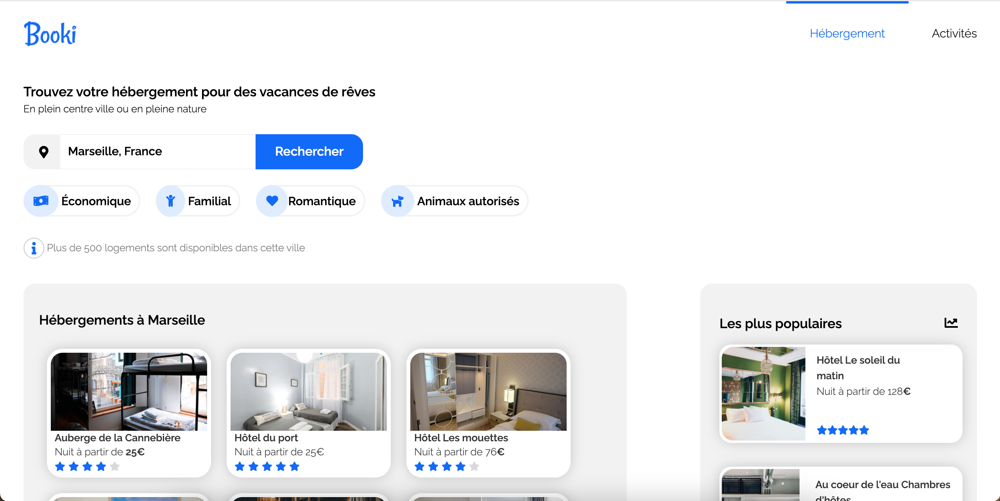

# Booki Project

Il s'agit de mon premier projet en HTML5 et CSS3
L'objectif de ce nouveau projet et d'utiliser une maquette et de faire un découpage pour créer une page HTML.

-> Prémière étape est donc de réflechir à la composition de la page

